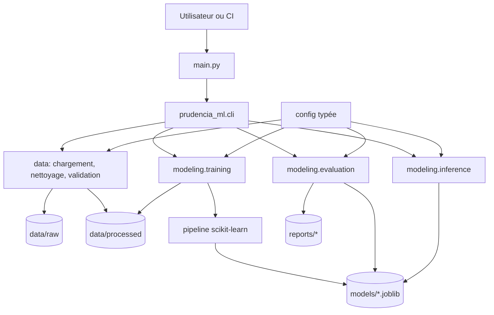
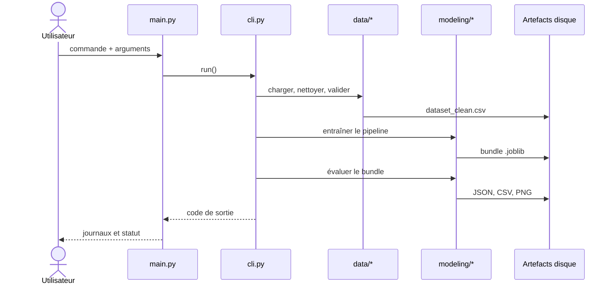

# Architecture cible — niveau 2

## 1. Objectif

Le niveau 2 transforme le socle pédagogique du niveau 1 en une application
Python structurée, testable et pilotée par un point d'entrée unique :
`main.py`. Il reste volontairement local et orienté ligne de commande : aucune
API FastAPI, interface Streamlit ou autre couche web n'est prévue.

Cette page décrit une **architecture cible**. Les modules actuels de `src/`
restent la référence fonctionnelle tant que la migration n'a pas été réalisée.

## 2. Principes

- un seul point d'entrée utilisateur, `main.py` ;
- séparation entre orchestration, logique métier ML et accès aux fichiers ;
- configuration centralisée et typée ;
- fonctions courtes, testables et sans effet de bord caché ;
- artefacts reproductibles et traçables ;
- même pipeline scikit-learn pour l'entraînement et la prédiction ;
- journalisation explicite, erreurs métier compréhensibles et validation aux
  frontières du système ;
- aucune métrique déclarée sans fichier d'évaluation généré par une exécution.

## 3. Arborescence cible

```text
.
├── main.py                         # point d'entrée CLI unique
├── pyproject.toml
├── README.md
├── data/
│   ├── SOURCE.md                   # provenance et licence
│   ├── raw/                        # données immuables
│   └── processed/                  # données nettoyées
├── models/                         # bundles sérialisés
├── reports/                        # métriques et graphiques générés
├── docs/
├── src/
│   └── prudencia_ml/
│       ├── __init__.py
│       ├── config.py               # paramètres et chemins
│       ├── cli.py                  # arguments et dispatch des commandes
│       ├── exceptions.py           # erreurs propres au domaine
│       ├── data/
│       │   ├── loading.py          # lecture et contrôles d'entrée
│       │   ├── cleaning.py         # nettoyage structurel
│       │   └── validation.py       # contrats du dataset
│       ├── modeling/
│       │   ├── pipeline.py         # ColumnTransformer + estimateur
│       │   ├── training.py         # split, fit et bundle
│       │   ├── evaluation.py       # calcul des métriques
│       │   └── inference.py        # validation et prédiction
│       ├── reporting/
│       │   └── exporters.py        # JSON, CSV et graphiques
│       └── utils/
│           ├── logging.py
│           └── filesystem.py
└── tests/
    ├── unit/
    ├── integration/
    └── fixtures/
```

Le passage de `src/*.py` à un paquet `src/prudencia_ml/` évite un espace de
noms générique et clarifie les responsabilités. Cette réorganisation devra
être faite progressivement, avec des tests verts à chaque étape.

## 4. Vue des composants



## 5. Responsabilités et dépendances

| Couche | Responsabilité | Ne doit pas faire |
|---|---|---|
| `main.py` | appeler la CLI et convertir une erreur en code de sortie | contenir la logique ML |
| `cli.py` | lire les arguments et appeler un cas d'usage | manipuler directement pandas ou joblib |
| `data/` | charger, nettoyer et valider les données | entraîner un modèle |
| `modeling/` | construire, entraîner, évaluer et utiliser le pipeline | connaître la syntaxe CLI |
| `reporting/` | sérialiser les résultats calculés | calculer ou embellir une métrique |
| `config.py` | fournir des paramètres explicites et immuables | déclencher un traitement à l'import |

Les dépendances doivent pointer vers les couches internes : l'interface CLI
dépend des cas d'usage, mais les cas d'usage ne dépendent pas de la CLI.

## 6. Point d'entrée `main.py`

Le fichier racine doit rester minimal :

```python
"""Point d'entrée de l'application Prudencia ML."""

from prudencia_ml.cli import run


if __name__ == "__main__":
    raise SystemExit(run())
```

La fonction `run()` pourra exposer les sous-commandes suivantes :

```text
python main.py preprocess --input data/raw/dataset.csv
python main.py train
python main.py evaluate
python main.py predict --input-json '{"sector": "health"}'
python main.py run-all --input data/raw/dataset.csv
```

`run-all` enchaîne les étapes, tandis que les commandes unitaires facilitent le
diagnostic et la CI. Les arguments explicites priment sur les valeurs par
défaut de la configuration.

## 7. Flux d'une exécution



## 8. Contrats d'artefacts

- Le CSV brut n'est jamais modifié.
- Le CSV nettoyé contient la cible configurée et au moins deux classes.
- Le bundle modèle contient au minimum le pipeline, les colonnes attendues, la
  cible, la configuration d'entraînement et les données de test utilisées pour
  l'évaluation.
- `metrics.json` est généré par le code, jamais rempli manuellement.
- Les rapports indiquent le nombre d'observations évaluées.
- Un artefact n'est publiable que si la source, la licence, la version des
  données, la configuration et la commande d'exécution sont documentées.

## 9. Gestion des erreurs et observabilité

Les modules profonds lèvent des exceptions précises ; seule la frontière CLI
les traduit en message utilisateur et code de sortie non nul. Les journaux
doivent indiquer l'étape, les chemins d'artefacts et les volumes utiles, sans
imprimer de données personnelles ni de lignes complètes du dataset.

Les erreurs attendues comprennent : fichier absent, CSV illisible, cible
absente, schéma invalide, classes insuffisantes, modèle incompatible et champ
de prédiction inconnu.

## 10. Tests attendus

- **unitaires** : normalisation, validation, construction du pipeline et
  validation du schéma d'inférence ;
- **intégration** : sérialisation puis rechargement du bundle, export des
  rapports et comportement de la CLI ;
- **bout en bout** : `preprocess → train → evaluate → predict` sur une fixture
  synthétique, sans prétendre que ses scores décrivent le modèle final ;
- **qualité** : `pytest` et `ruff check .` dans la CI.
