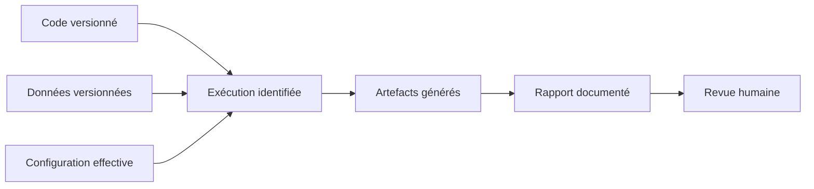

# Standards de code et de documentation

## 1. Objectif

Le code du niveau 2 doit être lisible par une personne qui apprend le Machine
Learning, tout en respectant des pratiques professionnelles. Les commentaires
pédagogiques expliquent les décisions et les risques ; ils ne paraphrasent pas
chaque instruction.

## 2. Règles générales Python

- Python 3.12 minimum, format compatible avec la limite Ruff de 88 caractères ;
- modules et fonctions en `snake_case`, classes en `PascalCase`, constantes en
  `UPPER_SNAKE_CASE` ;
- annotations de type pour toute fonction publique ;
- `pathlib.Path` pour les chemins ;
- configuration immuable via `dataclass(frozen=True)` lorsque pertinent ;
- pas de traitement lourd ni d'accès disque à l'import ;
- pas de `print` dans la logique métier : utiliser `logging`, sauf pour la
  sortie contractuelle d'une commande ;
- exceptions précises, avec messages actionnables ;
- aucune valeur métier sensible cachée dans le code.

## 3. Docstrings

Chaque module public commence par une docstring qui explique sa responsabilité.
Chaque classe et fonction publique documente son intention, ses entrées, sa
sortie et les erreurs significatives. Une fonction évidente peut rester
concise ; une fonction ML doit expliciter les précautions contre les fuites de
données.

Exemple cible :

```python
def split_dataset(
    dataframe: pd.DataFrame,
    target_column: str,
    config: TrainingConfig,
) -> DatasetSplit:
    """Sépare les variables de la cible et réserve le jeu d'évaluation.

    La stratification est appliquée uniquement lorsque chaque classe possède
    assez d'observations. Le jeu de test retourné ne doit être utilisé par
    aucune étape d'ajustement.

    Raises:
        ValueError: si la cible est absente ou ne permet pas la séparation.
    """
```

Les docstrings décrivent le contrat durable, pas une chronologie de
l'implémentation.

## 4. Commentaires pédagogiques

Un commentaire est utile lorsqu'il explique :

- **pourquoi** une transformation ou un paramètre a été choisi ;
- comment une fuite de données est empêchée ;
- quelle hypothèse métier est appliquée ;
- pourquoi un cas limite reçoit un traitement particulier ;
- quelle conséquence aurait une modification naïve ;
- quelle limite du modèle doit rester visible.

Exemples :

```python
# Ajuster l'imputation dans le Pipeline garantit que les statistiques du jeu
# de test ne participent pas à l'entraînement.
numeric_pipeline.fit(x_train[numeric_columns])
```

```python
# Une catégorie jamais vue à l'entraînement ne doit pas interrompre une
# prédiction ; elle est encodée sans créer une nouvelle colonne à l'inférence.
OneHotEncoder(handle_unknown="ignore")
```

Éviter :

```python
# Entraîne le modèle.
model.fit(x_train, y_train)
```

Le commentaire répète ici le code sans transmettre de connaissance.

## 5. Densité et maintenance des commentaires

Ne commenter ni chaque ligne ni une évidence syntaxique. Placer le commentaire
juste avant le bloc concerné et le mettre à jour dans le même commit que le
code. Un commentaire devenu faux est un défaut. Les marqueurs `TODO` doivent
contenir une action précise et, si le projet le permet, une référence d'issue.

```text
TODO(#42): remplacer la détection automatique par le schéma validé du dataset.
```

Ne jamais laisser un `TODO` vague comme « améliorer le modèle ».

## 6. Documentation du pipeline et des métriques

- Nommer la source de chaque résultat.
- Ne jamais saisir une métrique supposée ou « plausible ».
- Distinguer paramètres configurés, observations mesurées et objectifs métier.
- Indiquer le nombre d'échantillons avec toute métrique d'évaluation.
- Documenter la méthode d'agrégation (`weighted`, `macro`, etc.).
- Ne pas utiliser les résultats d'une fixture de test comme résultat modèle.
- Mettre à jour les diagrammes lorsque le flux change.



Une valeur dans un rapport doit pouvoir remonter à l'artefact, au run, à la
configuration, au code et aux données.

## 7. Journalisation

Utiliser les niveaux de façon cohérente :

| Niveau | Usage |
|---|---|
| `DEBUG` | détail technique utile au diagnostic |
| `INFO` | étape terminée, volume et chemin d'artefact |
| `WARNING` | mode dégradé explicite, par exemple split non stratifié |
| `ERROR` | échec qui empêche l'étape de produire son contrat |

Ne pas journaliser de lignes brutes, secrets, identifiants personnels ou
contenu complet d'une observation.

## 8. Tests comme documentation exécutable

Chaque comportement public significatif possède un test lisible. Utiliser le
schéma `given / when / then` dans la structure du test, sans imposer ces mots
en commentaires lorsque le code est déjà clair. Les fixtures synthétiques
doivent être explicitement identifiées comme telles.

Niveaux attendus :

- tests unitaires rapides des fonctions pures ;
- tests d'intégration des fichiers et de la sérialisation ;
- test bout en bout de la CLI `main.py` ;
- tests des erreurs attendues et des messages utilisateur.

Les assertions doivent porter sur le contrat, jamais sur une métrique
arbitraire d'un modèle stochastique, sauf si une fixture et une graine rendent
précisément ce comportement contractuel.

## 9. Revue de code

Avant validation :

- [ ] les noms rendent l'intention visible ;
- [ ] les fonctions publiques sont typées et documentées ;
- [ ] les commentaires expliquent les décisions non évidentes ;
- [ ] aucun commentaire ne contredit le code ;
- [ ] les données de test ne participent pas au `fit` ;
- [ ] les erreurs sont explicites ;
- [ ] aucun chiffre non généré n'est présenté comme un résultat ;
- [ ] les tests et `ruff check .` réussissent ;
- [ ] `main.py` reste un point d'entrée mince ;
- [ ] aucune dépendance FastAPI ou Streamlit n'est introduite.
