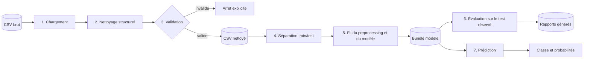
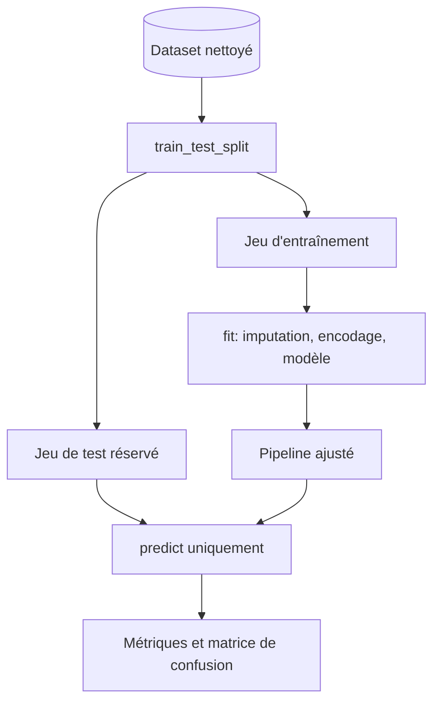

# Pipeline de Machine Learning

## 1. Finalité et périmètre

Le pipeline classe un projet d'intelligence artificielle selon la cible
`risk_level`. Il s'agit d'un démonstrateur pédagogique : sa sortie n'est ni une
décision juridique ni une preuve de conformité à l'AI Act.

Le niveau 1 implémente déjà les quatre opérations principales. Le niveau 2 les
orchestre depuis `main.py` et renforce leurs contrats, sans ajouter de serveur
web.

## 2. Vue générale

## 3. Étapes détaillées

### Étape 0 — Qualifier la source

Avant tout entraînement, `data/SOURCE.md` doit préciser le nom du dataset, sa
source officielle, son URL, sa licence, sa date de récupération et sa version.
Le fichier brut est conservé tel quel dans `data/raw/`.

### Étape 1 — Charger les données

Le chargeur vérifie l'existence du fichier puis lit le CSV. Une erreur de
lecture arrête le traitement ; elle ne doit pas être remplacée silencieusement
par un dataset vide.

### Étape 2 — Nettoyer sans changer le sens métier

Le nettoyage existant :

1. normalise les noms de colonnes en `snake_case` ;
2. retire les espaces aux extrémités des textes ;
3. convertit les chaînes vides en valeurs manquantes ;
4. supprime les doublons et les lignes entièrement vides ;
5. refuse les noms de colonnes vides ou dupliqués après normalisation.

Toute future transformation métier doit être documentée séparément, justifiée
et testée. Le CSV brut ne doit jamais être écrasé.

### Étape 3 — Valider le contrat du dataset

Le dataset nettoyé doit être non vide, contenir `risk_level`, ne présenter
aucune cible manquante et posséder au moins deux classes. Le niveau 2 pourra
ajouter un schéma explicite lorsque le dataset final sera choisi ; il ne faut
pas figer aujourd'hui des colonnes encore inconnues.

### Étape 4 — Séparer apprentissage et test

Les variables explicatives sont séparées de la cible, puis
`train_test_split` réserve un jeu de test. La configuration actuelle utilise
une graine fixe et tente une stratification si chaque classe comporte au moins
deux observations. Sinon, un avertissement indique que le split ne peut pas
être stratifié.

Le jeu de test ne participe ni à l'imputation, ni à l'encodage, ni à
l'entraînement.

### Étape 5 — Construire et entraîner le pipeline

Les colonnes sont détectées d'après leur type :

| Type | Valeurs manquantes | Transformation |
|---|---|---|
| numérique | imputation par la médiane | standardisation |
| catégoriel | imputation par la valeur la plus fréquente | one-hot encoding, catégories inconnues ignorées |

Le transformateur est suivi d'un `RandomForestClassifier`. Les paramètres
effectifs viennent de `TrainingConfig` et doivent être conservés avec
l'artefact. Le preprocessing et le classifieur forment un unique pipeline afin
que l'inférence réutilise exactement les transformations apprises.

### Étape 6 — Sérialiser le bundle

Le bundle `.joblib` actuel contient : pipeline ajusté, colonnes attendues,
colonne cible, jeu de test, étiquettes de test et configuration. Le niveau 2
devrait aussi enregistrer un identifiant de run, la date UTC, les versions des
dépendances et une empreinte du dataset, sans inclure de secret.

Un fichier `joblib` ne doit être chargé que depuis une source de confiance.

### Étape 7 — Évaluer

L'évaluation prédit le jeu de test réservé et calcule :

- accuracy ;
- précision, rappel et F1 pondérés ;
- nombre d'observations de test ;
- rapport détaillé par classe ;
- matrice de confusion.

Ces choix sont définis par le code existant. Aucune valeur numérique ne doit
figurer dans la documentation tant que `reports/metrics.json` n'a pas été
produit à partir du dataset final validé. Voir [TRAINING_REPORT.md](TRAINING_REPORT.md).

### Étape 8 — Prédire

Une observation JSON est convertie en ligne tabulaire dans l'ordre des
colonnes mémorisées. Une variable inconnue provoque une erreur ; une variable
attendue mais absente est confiée à l'imputation du pipeline. La sortie contient
la classe prédite et, lorsque l'estimateur le permet, les probabilités par
classe. Ces probabilités ne constituent pas une certitude juridique.

## 4. Prévention des fuites de données

Le pipeline est ajusté uniquement avec `x_train`. Cette règle garantit que les
statistiques d'imputation et les catégories observées dans le test ne
contaminent pas l'entraînement. Toute sélection de variables, normalisation ou
rééchantillonnage futur devra également être placé dans le pipeline ou appris
sur le train uniquement.

## 5. Reproductibilité

Une expérience reproductible conserve ensemble :

- la provenance et la version des données ;
- la configuration et la graine aléatoire ;
- la commande exacte ;
- les versions Python et des dépendances ;
- le bundle modèle et les rapports issus du même run.

La reproductibilité réduit les variations contrôlables ; elle ne garantit pas
à elle seule la validité métier, l'équité ou la conformité réglementaire.

## 6. Critères de passage du pipeline

Le traitement est techniquement réussi si chaque étape se termine sans erreur
et produit l'artefact attendu. L'acceptation du modèle, elle, nécessite des
seuils définis avec les parties prenantes après analyse du dataset et du coût
des erreurs. Aucun seuil de performance n'est inventé dans cette documentation.
