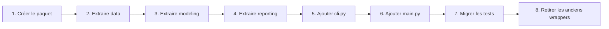
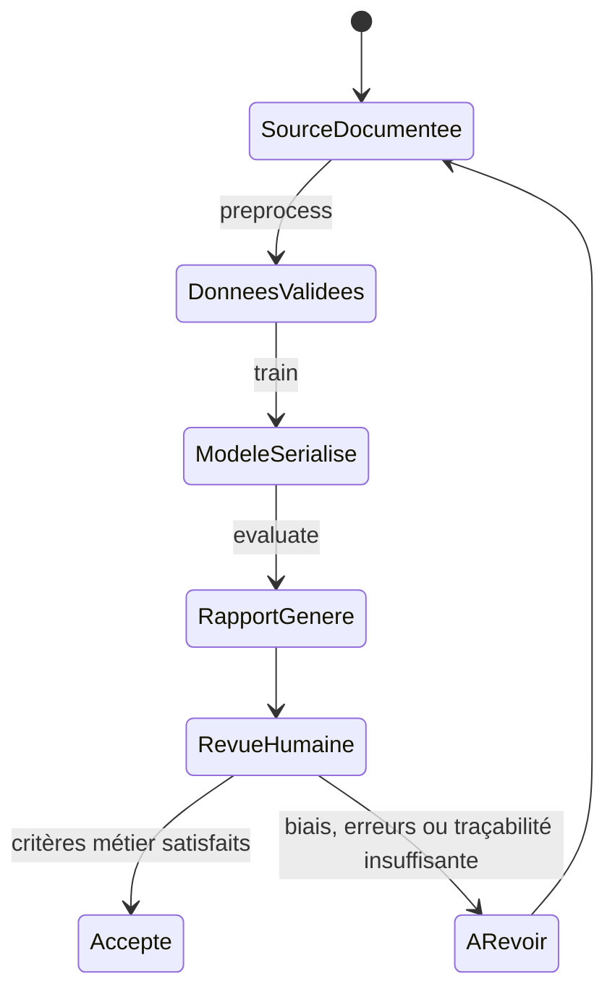

# Guide pas à pas — niveau 2

## 1. Préparer l'environnement

Python 3.12 ou supérieur est requis.

```bash
python3.12 -m venv .venv
source .venv/bin/activate
python -m pip install --upgrade pip
python -m pip install -e ".[dev,notebooks]"
```

Vérifier le socle avant toute évolution :

```bash
pytest
ruff check .
```

## 2. Documenter et déposer les données

1. Choisir un dataset public adapté au cas d'usage.
2. Vérifier sa licence et sa provenance.
3. Compléter tous les champs de `data/SOURCE.md`.
4. Déposer le CSV, sans le modifier, dans `data/raw/`.
5. Vérifier que sa cible peut être normalisée sous le nom `risk_level`.

Ne pas poursuivre vers un entraînement présenté comme final tant que la source
et la licence restent « à définir ».

## 3. Exécuter le niveau 1 actuel

En attendant l'implémentation de l'architecture niveau 2, les modules existants
restent exécutables :

```bash
python -m src.preprocessing --input data/raw/dataset.csv
python -m src.train
python -m src.evaluate
python -m src.predict --input-json '{"sector":"health","country":"FR"}'
```

Adapter l'observation JSON aux colonnes réelles du dataset. Les exemples
`sector` et `country` illustrent la syntaxe ; ils ne définissent pas le schéma
final.

## 4. Implémenter le point d'entrée du niveau 2

Créer `main.py` à la racine, puis déplacer progressivement les responsabilités
vers le paquet `prudencia_ml` décrit dans
[ARCHITECTURE_LEVEL_2.md](ARCHITECTURE_LEVEL_2.md). Le point d'entrée doit être
mince et déléguer à une fonction `run()` testable.

Ordre de migration conseillé :



À chaque étape, conserver les tests existants et ajouter les tests du nouveau
contrat avant de supprimer un ancien chemin d'import.

## 5. Prétraiter

Commande cible :

```bash
python main.py preprocess --input data/raw/dataset.csv
```

Contrôler ensuite :

- la présence de `data/processed/dataset_clean.csv` ;
- la présence de `risk_level` ;
- l'absence de cible manquante ;
- le nombre de lignes avant/après, avec une justification des suppressions ;
- la cohérence des types et des valeurs métier.

Le contrôle ne doit pas se limiter au fait que le fichier existe.

## 6. Entraîner

Commande cible :

```bash
python main.py train
```

Vérifier que le journal indique le chemin du modèle et le volume du jeu
d'entraînement. Le bundle doit réunir le preprocessing, le classifieur, le
schéma d'entrée et la configuration effective. Ne jamais modifier manuellement
un bundle sérialisé.

## 7. Évaluer

Commande cible :

```bash
python main.py evaluate
```

Les fichiers attendus sont :

```text
reports/metrics.json
reports/classification_report.csv
reports/confusion_matrix.csv
reports/confusion_matrix.png
```

Lire d'abord le nombre d'observations de test, puis les métriques par classe et
la matrice de confusion. Une moyenne globale peut masquer une classe rare mal
reconnue. Reporter uniquement les valeurs réellement présentes dans les
artefacts du run concerné.

## 8. Compléter le rapport d'entraînement

Dupliquer ou compléter les champs marqués « à renseigner après exécution » dans
[TRAINING_REPORT.md](TRAINING_REPORT.md). Associer chaque chiffre à un artefact,
un identifiant de run et une configuration. Si le dataset ou le modèle change,
produire un nouveau rapport au lieu d'écraser l'historique sans trace.

## 9. Tester une prédiction

Commande cible :

```bash
python main.py predict --input-json '{"champ_reel":"valeur"}'
```

Vérifier les trois cas : observation complète, variable attendue manquante et
variable inconnue. La prédiction doit rester présentée comme un résultat de
modèle, soumis à validation humaine, et non comme une qualification juridique.

## 10. Exécuter toute la chaîne

Après validation des commandes unitaires :

```bash
python main.py run-all --input data/raw/dataset.csv
```



## 11. Checklist avant livraison

- [ ] `data/SOURCE.md` est complet.
- [ ] Le fichier brut est conservé sans modification.
- [ ] La configuration du run est archivée.
- [ ] `pytest` réussit.
- [ ] `ruff check .` réussit.
- [ ] Les quatre artefacts d'évaluation proviennent du même bundle.
- [ ] Les résultats sont analysés globalement et par classe.
- [ ] Aucune métrique n'est copiée depuis une fixture ou inventée.
- [ ] Les limites juridiques et métier sont rappelées.
- [ ] Aucun service FastAPI ou Streamlit n'a été introduit.
