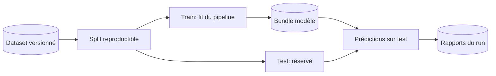

# Rapport d'entraînement

## Statut du document

**Aucun résultat final n'est disponible dans le dépôt à la date de rédaction.**
Le dataset public, sa licence et sa provenance doivent encore être validés, et
aucun `reports/metrics.json` issu d'un entraînement final n'est versionné.

Ce document est donc un gabarit de rapport. Les tests emploient des données
synthétiques pour vérifier le fonctionnement du code ; leurs résultats ne
doivent pas être présentés comme la performance du cas d'usage.

## 1. Identification de l'expérience

| Champ | Valeur |
|---|---|
| Identifiant du run | À renseigner après exécution |
| Date et heure UTC | À renseigner après exécution |
| Auteur | À renseigner |
| Commit Git | À renseigner |
| Version Python | À renseigner |
| Environnement | À renseigner |
| Commande exécutée | À renseigner |

## 2. Données

| Champ | Valeur |
|---|---|
| Nom du dataset | À reprendre depuis `data/SOURCE.md` |
| Source et URL | À reprendre depuis `data/SOURCE.md` |
| Licence | À reprendre depuis `data/SOURCE.md` |
| Version / date de récupération | À renseigner |
| Empreinte du fichier brut | À renseigner |
| Colonne cible | `risk_level` |
| Nombre de lignes brutes | À mesurer |
| Nombre de lignes nettoyées | À mesurer |
| Répartition des classes | À mesurer |

Décrire ici les exclusions, doublons supprimés, valeurs manquantes et limites
de représentativité. Toute différence entre la population réelle et le dataset
doit être explicitée.

## 3. Configuration d'entraînement

Les valeurs ci-dessous décrivent les valeurs par défaut du code niveau 1, pas
nécessairement celles d'un futur run :

| Paramètre | Valeur par défaut actuelle |
|---|---:|
| `test_size` | `0.2` |
| `random_state` | `42` |
| `n_estimators` | `200` |
| `min_samples_leaf` | `2` |
| `class_weight` | `balanced` |

Pour le run rapporté, recopier les valeurs effectives depuis le bundle ou la
configuration archivée et signaler toute différence.

## 4. Protocole

Le protocole actuel effectue un split apprentissage/test, stratifié lorsque les
effectifs le permettent. Les transformations sont apprises uniquement sur le
jeu d'entraînement. Les valeurs numériques sont imputées par la médiane et
standardisées ; les valeurs catégorielles sont imputées par le mode puis
encodées. Un Random Forest effectue la classification.

Préciser après exécution si la stratification a été appliquée et documenter
toute adaptation au protocole.

## 5. Résultats

Ne compléter ce tableau qu'en lisant le `reports/metrics.json` généré pour le
run identifié en section 1.

| Métrique | Valeur observée | Source |
|---|---:|---|
| Nombre d'observations de test | À renseigner | `reports/metrics.json` |
| Accuracy | À renseigner | `reports/metrics.json` |
| Précision pondérée | À renseigner | `reports/metrics.json` |
| Rappel pondéré | À renseigner | `reports/metrics.json` |
| F1 pondéré | À renseigner | `reports/metrics.json` |

Joindre ou référencer également :

- `reports/classification_report.csv` pour les résultats par classe ;
- `reports/confusion_matrix.csv` pour les erreurs détaillées ;
- `reports/confusion_matrix.png` pour la visualisation.

## 6. Analyse attendue

L'analyse doit répondre avec des observations vérifiables :

1. Quelles classes sont les mieux et les moins bien reconnues ?
2. Quelles confusions dominent et quel est leur coût métier ?
3. Les effectifs de test sont-ils suffisants par classe ?
4. Le déséquilibre des classes influence-t-il les moyennes pondérées ?
5. Existe-t-il des sous-populations insuffisamment représentées ?
6. Les résultats sont-ils stables sur plusieurs splits ou en validation croisée ?

Ne pas conclure à la conformité juridique à partir des seules métriques ML.

## 7. Biais, risques et limites

À compléter après l'analyse des données : couverture sectorielle et
géographique, qualité des labels, biais de sélection, données manquantes,
variables proxy, dérive temporelle et conséquences des faux positifs/faux
négatifs. Documenter aussi les limites du Random Forest et l'interprétabilité
disponible.

## 8. Décision et suites

| Élément | Décision |
|---|---|
| Critères d'acceptation métier | À définir avec les parties prenantes |
| Résultat face aux critères | À renseigner après exécution |
| Décision | Non prise |
| Actions correctives | À définir |
| Responsable de la revue | À renseigner |

La décision finale doit être humaine, datée et reliée aux artefacts exacts du
run. L'absence de seuil dans ce gabarit est volontaire : un seuil doit découler
du risque métier et réglementaire, pas d'une valeur arbitraire.
